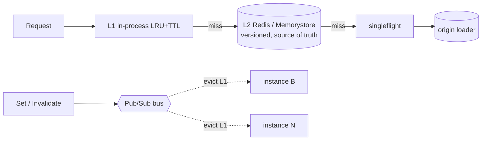

# runcache

**Cloud Run-first caching for Go.** A fast in-process L1, a shared versioned L2 (the source of truth), and a Pub/Sub invalidation bus that keeps per-instance caches coherent across ephemeral, autoscaling instances.

[](LICENSE)
[](go.mod)

> **Status: pre-v0.1.** L1, L2 (Redis), stampede protection, stale-while-revalidate, the **cross-instance Pub/Sub bus**, OpenTelemetry metrics, and a deployable Cloud Run example (Dockerfile + Terraform) are all implemented and tested (integration against real Redis and the Pub/Sub emulator via testcontainers). APIs may still change before v0.1.

---

## Why caching on Cloud Run is hard

Naive caching breaks on Cloud Run for three reasons:

1. **Instances are ephemeral and scale to zero.** In-memory caches vanish on scale-down. When traffic spikes from 0 to N, *every* new instance starts cold and stampedes the database at the worst moment.
2. **There is no shared memory between instances.** A request lands on any instance, so in-process caches diverge, and because instances are ephemeral you cannot address them individually to invalidate.
3. **Cost vs. latency is a real tradeoff.** An external cache (Memorystore) gives coherence but adds cost, latency, and a VPC connector; in-memory is free but volatile.

`runcache` handles these tradeoffs so you do not re-implement them in every service.

---

## How it works

Three tiers, one rule: **L2 is the source of truth; L1 is a best-effort per-instance accelerator; the bus is a latency optimization, not the sole coherence mechanism.**



The correctness backbone is the **fill invariant**: no value enters L1 except stamped with a version minted by L2, decided atomically against concurrent invalidations (a CAS on write). A value loaded by an in-flight fill is discarded, not cached, if the key was invalidated while the loader ran. An instance that misses a bus broadcast still converges on its next L2 read, because L2 versions are authoritative.

Keys are string-keyed internally (`Store[V]`), with the user's key type `K` living only on the public `Cache[K, V]`, so eviction-by-key is consistent across L1, L2, and the bus.

---

## Quickstart

```go
cache, err := runcache.NewBuilder[string, User](loadUser).
    L1(memory.New[User]()).               // in-process accelerator
    L2(redisstore.New[User](rdb, store.JSON[User]())). // shared source of truth
    TTL(30*time.Second, 5*time.Minute).   // fresh window + stale-while-revalidate window
    Jitter(0.1).                          // desync expiries
    NegativeTTL(2 * time.Second).         // cache known-absent keys
    Build()
if err != nil {
    log.Fatal(err)
}
defer cache.Close()

// Read-through with stampede protection: concurrent misses collapse to one load.
v, err := cache.GetOrLoad(ctx, "user:42")
switch {
case errors.Is(err, runcache.ErrNotFound): // known-absent (negative hit)
case err != nil:                           // transient failure (not cached)
default:                                    // use v
}
```

The loader signals a missing key by returning `runcache.ErrNotFound`, which triggers negative caching. The builder names the types once; every option is a plain method.

---

## Caching techniques

| Technique | Solves |
|---|---|
| Multi-tier L1/L2 | speed of in-process + coherence of a shared store |
| Singleflight | cold-start thundering herd on the origin |
| Stale-while-revalidate | tail latency and backend resilience |
| TTL + jitter | cache avalanche from synchronized expiry |
| Negative caching | DB pressure from missing-key lookups |
| Versioned fill invariant | the fill-after-invalidate stale-read race |
| Cross-instance invalidation (Pub/Sub) | coherence across ephemeral replicas |

---

## Performance

Benchmarks (`go test -bench=. -benchmem`). Hot paths allocate **zero** times per operation. Numbers below are from an Apple-class CPU running the `darwin/amd64` toolchain under emulation, so treat them as indicative and relative, not absolute.

| Operation | Latency | Allocations |
|---|---:|---:|
| L1 `Get` (hit) | ~95 ns/op | 0 B, 0 allocs |
| L1 `Set` | ~47 ns/op | 0 B, 0 allocs |
| L1 `Get` (parallel) | ~115 ns/op | 0 B, 0 allocs |
| `GetOrLoad` (L1 hit) | ~181 ns/op | 0 B, 0 allocs |
| `GetOrLoad` (L1 hit, parallel) | ~307 ns/op | 0 B, 0 allocs |
| `Get` (L1 hit) | ~179 ns/op | 0 B, 0 allocs |
| Invalidation dedupe (`Seen`) | ~22 ns/op | 0 B, 0 allocs |
| In-process bus publish (`Mem`) | ~185 ns/op | 0 B, 0 allocs |

The ~85 ns gap between a raw L1 `Get` and `GetOrLoad` is the key-string mapping, freshness check, and stats accounting on the hot path. L2 (Redis) reads and the `gcppubsub` bus are dominated by network and Redis/Pub/Sub round-trips, not CPU, so they are exercised in the integration suite rather than micro-benchmarked.

Reproduce with:

```sh
go test -run='^$' -bench=. -benchmem ./...
```

---

## Observability

Import `runcache/metrics` to export cache statistics as OpenTelemetry metrics.
It observes `Stats()` through asynchronous instruments, so it adds nothing to the
hot path, and the core package keeps no OpenTelemetry dependency:

```go
reg, err := metrics.Register(meter, cache) // meter is an otel metric.Meter
defer reg.Unregister()
```

It reports `runcache.hits`, `.stale_hits`, `.misses`, `.loads`, `.load_errors`,
`.negative_hits`, `.refreshes`, `.bus_evicts`, `.evictions`, and `.l1.entries`.

## Try it locally

`demo/local/` brings up two cache instances + Redis in Docker so you can watch
L1/L2 sharing on your laptop (see `demo/local/README.md`). For the full
cross-instance bus over Pub/Sub deployed to Cloud Run via Terraform, see
`examples/cloudrun/` (Cloud Run + Memorystore + Pub/Sub + Direct VPC Egress).

---

## When *not* to use this

- A single long-lived instance with plenty of memory: a plain in-process cache (Ristretto, Otter) is simpler.
- Reads that must be strongly consistent: `runcache` is eventually consistent across instances by design.
- Near-100% write workloads: the machinery is not worth it.

`runcache` is for read-heavy, high-traffic services on autoscaling Cloud Run where cold starts and cross-instance coherence actually bite.

---

## Design notes

The in-memory cache space in Go is well served by [Ristretto](https://github.com/dgraph-io/ristretto) and [Otter](https://github.com/maypok86/otter). `runcache` does not try to out-compete them on raw eviction; its value is the **serverless orchestration layer**: tiering, the versioned fill invariant, cross-instance coherence, and a deployable reference. The L1 is hand-written behind the `store.Store` interface, so a faster engine can be dropped in later.

Integration tests (Redis, and the Pub/Sub emulator) live in a separate module under `test/integration/` so the library's own dependents pull only `rueidis` and `golang.org/x/sync`, never the test infrastructure.

A deeper write-up of the coherence protocol lives in [`DESIGN.md`](DESIGN.md).

---

## License

Apache-2.0. See [LICENSE](LICENSE).
